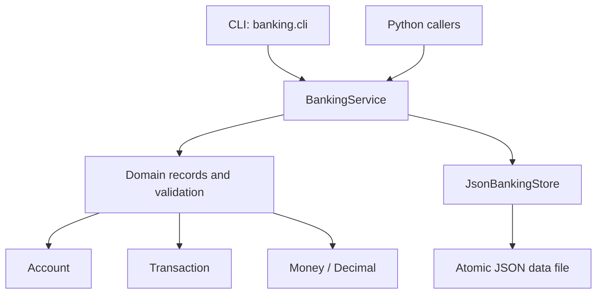

# Enterprise Banking Transaction System

A production-minded local banking ledger for creating accounts, recording deposits and withdrawals, transferring funds, and auditing transaction history from a clean Python API or command-line interface.

This repository was upgraded from an empty placeholder into a working, tested project. It intentionally keeps infrastructure light: the core banking rules are implemented in pure Python, persisted through an atomic JSON store, and covered by focused automated tests.

## Table of Contents

| Section | Purpose |
| --- | --- |
| [Capabilities](#capabilities) | What the system does |
| [Architecture](#architecture) | How the project is organized |
| [Installation](#installation) | Local setup steps |
| [CLI Usage](#cli-usage) | Commands and examples |
| [Python API](#python-api) | Programmatic use |
| [Data Model](#data-model) | Accounts, transactions, and persistence |
| [Validation and Safety](#validation-and-safety) | Correctness and reliability behavior |
| [Testing](#testing) | How to validate the project |
| [Troubleshooting](#troubleshooting) | Common problems and fixes |
| [Implementation Notes](#implementation-notes) | Design choices and limits |

## Capabilities

| Capability | Details |
| --- | --- |
| Account creation | Creates active accounts with owner name, currency, opening balance, timestamps, and generated IDs. |
| Deposits | Adds positive funds to an active account and records a ledger entry. |
| Withdrawals | Debits positive funds only when the account has sufficient balance. |
| Transfers | Moves funds atomically between two active accounts in the same currency. |
| Ledger | Records deposits, withdrawals, transfers, opening balances, descriptions, and idempotency keys. |
| Idempotency | Reusing a key for the same transaction returns the original ledger entry; reusing it for a different payload is rejected. |
| Persistence | Writes account and transaction state to JSON using atomic file replacement. |
| CLI and API | Supports both terminal workflows and direct Python integration. |

## Architecture



### Project Layout

| Path | Responsibility |
| --- | --- |
| `src/banking/domain.py` | Domain models, money validation, custom exceptions, serialization helpers. |
| `src/banking/service.py` | Business operations for account lifecycle and transactions. |
| `src/banking/store.py` | Atomic JSON persistence boundary. |
| `src/banking/cli.py` | `ebank` command-line interface. |
| `tests/` | Unit and CLI tests for critical behavior. |
| `pyproject.toml` | Packaging metadata and console script configuration. |

## Installation

### Requirements

| Tool | Version |
| --- | --- |
| Python | 3.9 or newer |
| pip | Any modern version |
| unittest | Included in the Python standard library |

### Setup

```bash
python3 -m venv .venv
source .venv/bin/activate
python3 -m pip install --upgrade pip
python3 -m pip install -e .
```

The editable install exposes the `ebank` command and allows local source edits to take effect immediately.

## CLI Usage

By default, the CLI stores data at:

```text
~/.enterprise-banking/bank.json
```

You can override the store location with `--store` or `EBANK_STORE`.

### Create an Account

```bash
ebank create-account "Ada Lovelace" --opening-balance 100.00 --currency USD
```

### List Accounts

```bash
ebank list-accounts
```

### Show One Account

```bash
ebank show-account acct_123
```

### Deposit Funds

```bash
ebank deposit acct_123 25.00 --description "Cash deposit" --idempotency-key deposit-001
```

### Withdraw Funds

```bash
ebank withdraw acct_123 10.00 --description "ATM withdrawal"
```

### Transfer Funds

```bash
ebank transfer acct_source acct_destination 50.00 --description "Vendor payment" --idempotency-key transfer-001
```

### View Ledger

```bash
ebank ledger
ebank ledger --account-id acct_123
```

### JSON Output

Every command can emit structured output:

```bash
ebank --json list-accounts
```

## Python API

```python
from banking.service import BankingService
from banking.store import JsonBankingStore

service = BankingService(JsonBankingStore("bank.json"))

source = service.create_account("Grace Hopper", "250.00", "USD")
destination = service.create_account("Katherine Johnson", "25.00", "USD")

service.transfer(
    source.id,
    destination.id,
    "75.00",
    description="Project settlement",
    idempotency_key="settlement-2026-001",
)

print(service.get_account(source.id).balance)
print(service.list_transactions(source.id))
```

## Data Model

### Account

| Field | Description |
| --- | --- |
| `id` | Generated account ID with `acct_` prefix. |
| `owner_name` | Trimmed owner name, minimum two characters. |
| `balance` | Two-decimal `Decimal` value. |
| `currency` | Three-letter uppercase currency code. |
| `status` | `active` or `closed`. |
| `created_at` | UTC ISO-8601 timestamp. |
| `updated_at` | UTC ISO-8601 timestamp. |

### Transaction

| Field | Description |
| --- | --- |
| `id` | Generated transaction ID with `txn_` prefix. |
| `type` | `deposit`, `withdrawal`, or `transfer`. |
| `amount` | Positive two-decimal `Decimal` value. |
| `currency` | Transaction currency. |
| `source_account_id` | Debited account for withdrawals and transfers. |
| `destination_account_id` | Credited account for deposits and transfers. |
| `description` | Optional trimmed description. |
| `idempotency_key` | Optional duplicate-protection key. |
| `created_at` | UTC ISO-8601 timestamp. |

## Validation and Safety

| Concern | Behavior |
| --- | --- |
| Money precision | All monetary values are parsed with `Decimal` and quantized to two decimal places. |
| Negative or zero transactions | Rejected for deposits, withdrawals, and transfers. |
| Overdrafts | Rejected before any mutation is saved. |
| Closed accounts | Cannot be deposited into, withdrawn from, or used in transfers. |
| Account closure | Allowed only when balance is exactly zero. |
| Cross-currency transfers | Rejected unless source and destination currencies match. |
| Self-transfers | Rejected. |
| Persistence safety | Writes use a temporary file followed by `os.replace` for atomic replacement. |
| Idempotency | Duplicate transaction requests do not double-apply balances. |

## Testing

Run the complete test suite:

```bash
python3 -m unittest discover -s tests
```

The tests cover:

| Area | Coverage |
| --- | --- |
| Account creation | Opening balance rounding and ledger creation. |
| Transfers | Atomic source/destination balance updates and ledger entries. |
| Withdrawals | Overdraft rejection without state mutation. |
| Idempotency | Duplicate request safety and conflict detection. |
| Closed accounts | Mutation rejection. |
| Validation | Invalid amounts and self-transfer rejection. |
| CLI | JSON output and domain error reporting. |

## Troubleshooting

| Problem | Resolution |
| --- | --- |
| `ebank: command not found` | Run `python3 -m pip install -e .` inside the repository and reactivate the virtual environment. |
| `ModuleNotFoundError: banking` | Install the package with `python3 -m pip install -e .` or run commands with `PYTHONPATH=src` while developing. |
| Store read/write error | Check that the `--store` directory exists or that the current user can create it. |
| JSON decode error | The store file is not valid JSON. Restore it from backup or start with a new `--store` path. |
| Withdrawal or transfer rejected | Confirm the account is active and has sufficient available balance. |
| Account close rejected | Withdraw or transfer the remaining balance first. |

## Implementation Notes

This project is intentionally scoped as a local transaction ledger, not a full banking core. It does not implement authentication, database locking across multiple processes, regulatory reporting, ACH/card integrations, interest accrual, or real-time fraud controls.

For a multi-user production deployment, the next architectural step would be replacing the JSON store with a transactional database, adding authentication and authorization, enforcing database-level idempotency constraints, and introducing audit logging that cannot be rewritten by normal application users.

## Command Reference

| Command | Purpose |
| --- | --- |
| `ebank create-account OWNER` | Create an account. |
| `ebank list-accounts` | List accounts. |
| `ebank show-account ACCOUNT_ID` | Show account details. |
| `ebank close-account ACCOUNT_ID` | Close a zero-balance account. |
| `ebank deposit ACCOUNT_ID AMOUNT` | Deposit funds. |
| `ebank withdraw ACCOUNT_ID AMOUNT` | Withdraw funds. |
| `ebank transfer SOURCE_ID DESTINATION_ID AMOUNT` | Transfer funds. |
| `ebank ledger` | List ledger entries. |

## Development Workflow

```bash
python3 -m pip install -e .
python3 -m unittest discover -s tests
```

Keep domain rules in `domain.py`, business workflows in `service.py`, persistence in `store.py`, and command parsing in `cli.py`. That separation keeps high-value behavior testable without depending on terminal output or filesystem details.
